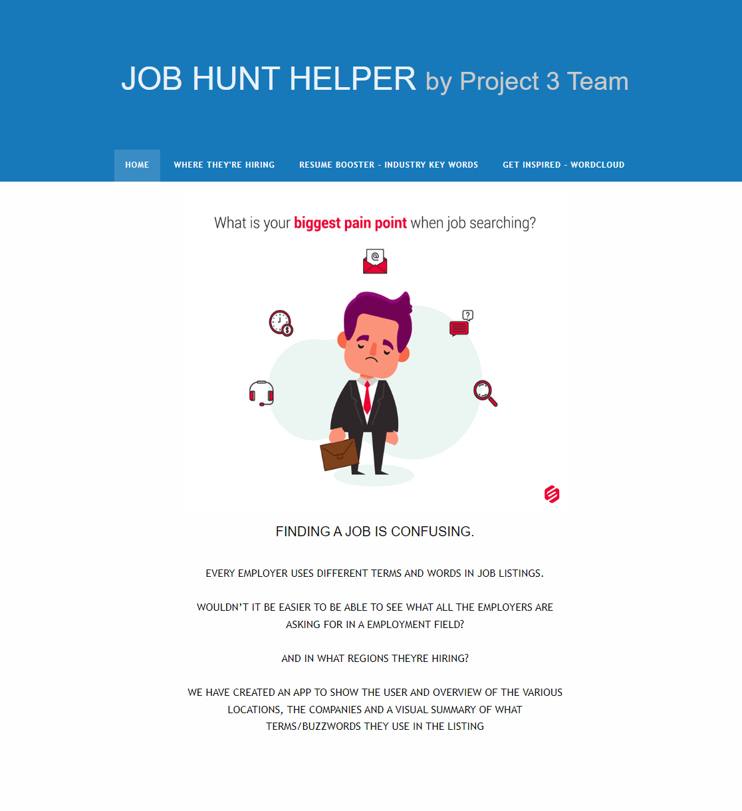
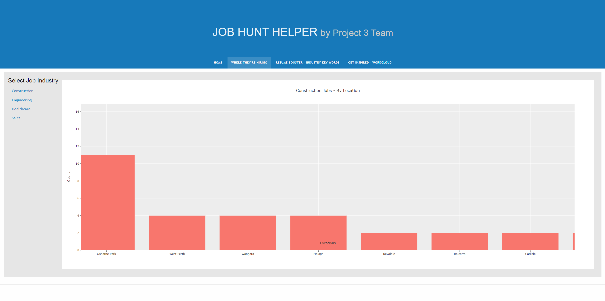
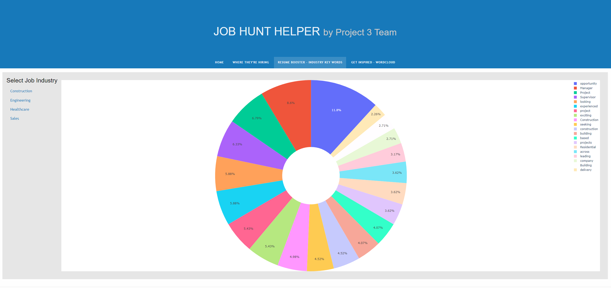
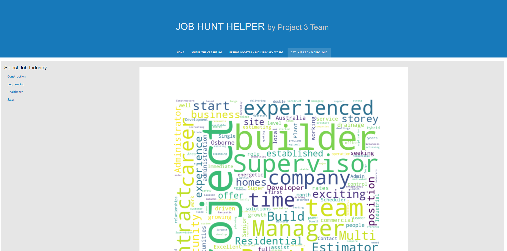

# Project 3
UWA Data Analysis Bootcamp - Project 3 - Team 3

## Perth Job Market Insights: A Web Scraper for Construction, Engineering, Healthcare, and Sales Job Ads
Welcome to the Perth-based job ad word scraper! This tool is specifically designed for job seekers looking for construction, engineering, healthcare, and sales jobs in Perth, Western Australia. By analyzing the language used in job postings in these industries, you can gain a deeper understanding of what employers are looking for in potential candidates. By focusing on the most frequently used words in these job ads, you can fine-tune your resume, cover letter, and interview responses to match the skills and experience that are in high demand. With this scraper, you'll be well on your way to landing your next job in Perth's dynamic job market!

## Data Sources
Seek: https://www.seek.com.au/?where=All%20Perth%20WA

## Built With
- Flask - The web framework used
- Plotly.js - JavaScript library for creating interactive charts

## Database Diagram

## Flask App
#### LANDING PAGE

 

#### LOCATION PLOT

 

#### BUZZWORD PLOT

 

#### WORDCLOUD PLOT

# Project 3
UWA Data Analysis Bootcamp - Project 3 - Team 3
-----
### Project 3 Overview
#### Requirements

For Project 3, you will work with your group to tell a story using data visualisations. Here are the specific requirements:

Your visualisation must include a Python Flask–powered API, HTML/CSS, JavaScript, and at least one database (SQL, MongoDB, SQLite, etc.).

Your project should fall into one of the following three tracks:

A combination of web scraping and Leaflet or Plotly

A dashboard page with multiple charts that update from the same data

A server that performs multiple manipulations on data in a database prior to visualisation (must be approved)

Your project should include at least one JS library that we did not cover.

Your project must be powered by a dataset with at least 100 records.

Your project must include some level of user-driven interaction (e.g., menus, dropdowns, textboxes).

Your final visualisation should ideally include at least three views. For this project, you can focus your efforts within a specific industry.

Project ideation

Data fetching/API integration

Data analysis

Testing

Creating documentation

Creating the presentation

Since this is a two-week project, make sure that you have done at least half of your project by the end of the first week in order to stay on track.

Although you will divide the work among the group members, it’s essential to collaborate and communicate while working on different parts of the project. Be sure to check in with your teammates regularly and offer support.

Support and Resources
Your instructional team will provide support during classes and office hours. You will also have access to learning assistants and tutors to help you with topics as needed. Make sure to take advantage of these resources as you collaborate with your group on this first project.

Technical Requirements for Project 3
Data and Delivery (20 points)
Data components used in the project are clearly documented. (5 points)
The dataset contains at least 100 unique records. (5 points)
A database is used to house the data (SQL, MongoDB, SQLite, etc.). (5 points)
The project is powered by a Python Flask API and includes HTML/CSS, JavaScript, and the chosen database. (5 points)
Back End (20 points)
The page created to showcase data visualisations runs without error. (5 points)
A JavaScript library not shown in class is used in the project. (5 points)
The project conforms to one of the following designs: (10 points)
A Leaflet or Plotly chart built from data gathered through web scraping.
A dashboard page with multiple charts that all reference the same data.
Visualisations (20 points)
A minimum of three unique views present the data. (5 points)
Multiple user-driven interactions (such as dropdowns, filters, or a zoom feature) are included on the final page. (5 points)
The final page displays visualisations in a clear, digestable manner. (5 points)
The data story is easy to interpret for users of all levels. (5 points)
Group Presentation (20 points)
All group members speak during the presentation. (5 points)
Content, transitions, and conclusions flow smoothly within any time restrictions. (5 points)
The content is relevant to the project. (5 points)
The presentation maintains audience interest. (5 points)
Project Guidelines
The following project guidelines focus on teamwork, your project proposal, data sources, and data cleanup and analysis.

Collaborating with Your Team
Remember that these projects are a group effort. The experience of close collaboration will create better project outcomes and help you in your future careers. Specifically, you’ll learn collaborative workflows that will enable you to approach and solve complex problems. Working in groups allows you to work smart and dream big. Take advantage!

#### Project Proposal

Before you start writing any code, your group should outline the scope and purpose of your project. This will help provide direction and safeguard against scope creep (the tendency for projects to become more complex after work begins).

The proposal is essentially a brief summary of your interests and intent. Be sure to include the following details:

The kind of data you’d like to work with and the field you’re interested in (finance, healthcare surveys, etc.)

The questions you’ll ask of the data

Possible source for the data

Use the following example for guidance:

The aim of our project is to uncover patterns in credit card fraud. We’ll examine relationships between transaction types and location, purchase prices and times of day, purchase trends over the course of a year, and other related relationships derived from the data.

#### Finding Data

Once your group has written a proposal, it’s time to start searching for data. We recommend the following curated sources of high-quality data:

data.worldLinks to an external site.

KaggleLinks to an external site.

Data.gov.auLinks to an external site.

Awesome Public DatasetsLinks to an external site.

Public-APIsLinks to an external site.

Awesome APILinks to an external site.

Medium API ListLinks to an external site.

IMPORTANT
Whenever you use a dataset or create a new dataset based on other sources (such as existing datasets or information scraped from websites), make sure to use the following guidelines:

Check for copyright protections, and make sure that the way you plan to use this dataset is within the bounds of fair use.

Document how you intend to use this dataset now and in the future. Find any licences or terms of use associated with the dataset, and review them to confirm that your intended use is in compliance.

Investigate how the dataset was collected. Identify any indicators that the data was obtained from a source that the compilers were not authorised to access.

You’ll likely have to adjust your project plan as you explore the available data. That’s okay! This is all part of the process. Just make sure that everyone in the group is aligned on the project’s goals as you make changes.

Make sure that your datasets are not too large for your personal computer. Big datasets are difficult to manage locally, so consider using data subsets or different datasets altogether.

#### Data Cleanup and Analysis

Now that you’ve picked your data, it’s time to tackle development and analysis. This is where the fun starts!

The analysis process can be broken into two broad phases: (1) exploration and cleanup, and (2) analysis.

As you’ve learned, you’ll need to explore, clean, and reformat your data before you can begin answering your research questions. We recommend keeping track of these exploration and cleanup steps in a dedicated Jupyter notebook to keep you organised and make it easier to present your work later.

After you’ve cleaned your data and are ready to start crunching numbers, you should track your work in a Jupyter notebook dedicated specifically to analysis. We recommend focusing your analysis on multiple techniques, such as aggregation, correlation, comparison, summary statistics, sentiment analysis, and time-series analysis. Don’t forget to include plots during both the exploration and analysis phases. Creating plots along the way can reveal insights and interesting trends in the data that you might not notice if you wait until you’re preparing for your presentation. Presentation requirements will be further explained in the next module.

## Presentation Day
It’s crucial that you find time to rehearse before presentation day.

On the day of your presentation, each member of your group is required to submit the URL of your GitHub repository for grading.
